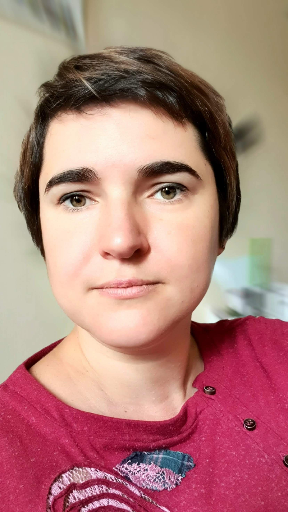

## Olga Pyryeva

---

## tel. +375 29 7012003

---

## email: vashkevicholga@gmail.com

---

nickname on the discord server: Ольга Пырьева (@OlgaPyryeva)

---

About me

A recent graduate of Belhard Web Development Certification Program, a dedicated and reliable
specialist with 10 years of experience in technical support. Specializing in communicating and
interacting with clients, creative problem solving skills resulting in company’s increased orders. Looking
to contribute my skills and experience to the web development department at your company.

---

Skills:

---

- HTML
- CSS
- Analitical skills
- Interpersonal skills
- Testing skills

---

Languages:

- English level B1

---

Сode examples:

```
function sum(x, n) {
   return (x + n);
}
```

---

My projects:
https://github.com/OlgaPyryeva/3DGlo.git

---

Education:

---

Faculty of Finance and Banking/Economist
Belarusian State Economic University
09/1998 - 05/2003, Minsk

Belhard Web Development
Certification Program

WORK EXPERIENCE:

---

- Software Support Specialist
  1С-Minsk

11/2022 - Until now

- Leading Engineer for Automation of
  Enterprise Management Systems
  Technical support department/"Top Soft"
  OOO (LLC)

08/2019 - 03/2021, Minsk

Top Soft is a leading IT company that solves the most difficult tasks to
provide its customers with the most modern information systems.
Provided technical support to users of Galaktika ERP
Demonstrated program capabilities for solving custom
business processes
Aided in solving the issue that users encountered when
working with the program
Analyzed suggestions for improving the program
Advised solutions for users
